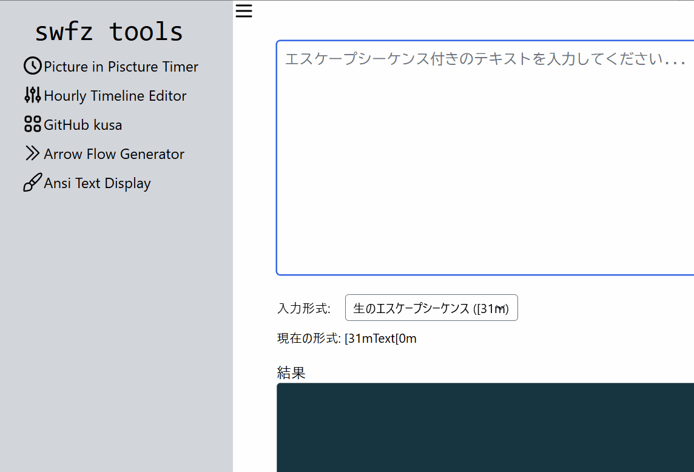

# chrome-extension-dom-links-extractor

指定のDOM以下のAタグ内のリンクURLを改行区切りでクリップボードにコピーするChrome拡張



NotebookLMなどの資料をまとめて登録する際などに便利に使える


## 使い方メモ
- 拡張機能ボタンをクリックするとホバーで対象要素がハイライトされ、要素内のリンク数ポップアップが表示されます。
- 対象要素をクリックすると、内部リンクが改行区切りでクリップボードにコピーされます。
- コピー成功/失敗は画面右下のトーストで表示されます（成功=緑、失敗=赤）。

## テスト
- ランナー: Vitest（JSDOM）。
- セットアップ: `npm i` 後、`npm test`。
- 主なテスト範囲:
  - `helpers/extract.js`: 指定要素以下の有効な `href` 抽出。
  - `helpers/toast.js`: トースト生成/表示/自動消滅とコンテナの後片付け。

## ビルド（バンドル）
一部環境でESMのContent Script読み込みに失敗するため、`content.js` を1ファイルにバンドルして `content.bundle.js` として読み込みます。

- 依存インストール: `npm i`
- ビルド: `npm run build`
- ウォッチ: `npm run dev`

拡張機能の再読み込み（`chrome://extensions` で対象を「リロード」）後、動作を確認してください。現在は「ボタン押下時に能動注入（activeTab + scripting）」方式です。`background.js` が以下を行います。

- `inspector.css` を注入
- `content.bundle.js` を `chrome.scripting.executeScript` で注入
- 注入完了後に `activate_inspector` メッセージを送信し、コンテンツ側でアクティブ化

注: `content.bundle.js` は再注入時の二重リスナー登録を避けるため、ロードガード（`window.__domLinksExtractorLoaded`）を持ちます。

## 配布（ZIP パッケージ）
Chrome Web Store に提出する際の手順です。

1. 依存インストール: `npm i`
2. バンドル生成: `npm run build`（`content.bundle.js` を更新します）
3. ZIP 作成（開発用ファイルを除外）

   macOS/Linux 例:

   ```bash
   zip -r dom-links-extractor.zip . \
     -x ".git*" \
     -x "node_modules/*" \
     -x "tests/*" \
     -x "*.spec.js" \
     -x "AGENTS.md" \
     -x "vitest.config.mjs" \
     -x "package-lock.json"
   ```

4. Chrome デベロッパーダッシュボードで ZIP をアップロード → 審査 → 公開。

### ZIP に含める主なファイル
- `manifest.json`
- `background.js`
- `content.bundle.js`（必須）
- `inspector.css`
- `images/16x16.png`, `32x32.png`, `48x48.png`, `128x128.png`
- `README.md`（任意）
